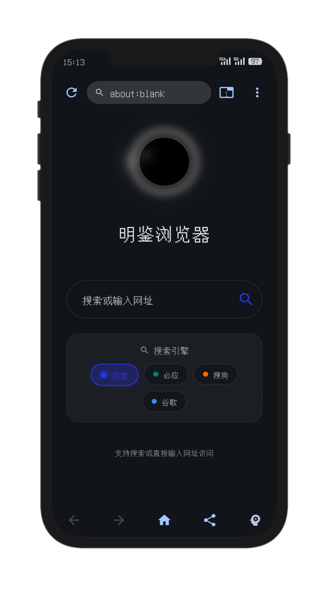
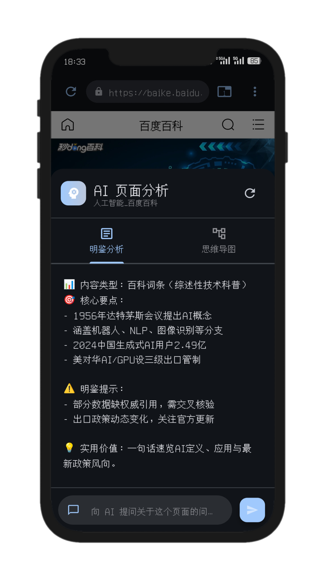
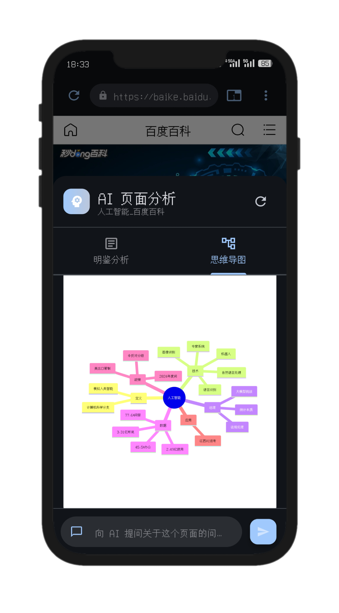

# 明鉴浏览器 (MJ Browser)

<div align="center">


**一款集成 AI 智能分析的现代化移动浏览器**

[功能特性](#-功能特性) • [项目背景](#-项目背景) • [核心功能](#-核心功能) • [快速开始](#-快速开始) • [项目结构](#-项目结构)

</div>

---

## 📖 项目背景

在信息爆炸的移动互联网时代，用户每天浏览大量网页内容，但往往面临以下痛点：

- **信息过载**：网页内容冗长，难以快速提取核心信息
- **理解困难**：复杂的长文章、技术文档缺乏结构化呈现
- **记忆负担**：浏览过的内容难以形成系统化的知识体系

**明鉴浏览器**正是为解决这些问题而生。通过集成先进的 AI 技术，我们将传统浏览器与智能分析能力深度融合，让用户不仅能"看"内容，更能"懂"内容。

### 💡 设计思路

1. **AI 赋能阅读**：利用大语言模型对网页内容进行深度分析，自动提取关键信息
2. **可视化知识**：将复杂内容转化为直观的思维导图，降低理解门槛
3. **极简交互**：保持浏览器核心功能的同时，用一键操作实现 AI 分析
4. **跨平台体验**：基于 Flutter 开发，确保 Android 和 iOS 平台的一致性体验

---

## ✨ 功能特性

### 🤖 AI 智能分析（核心特性）

#### 1. **一键智能摘要**
- 📝 自动提取网页核心观点和关键信息
- 🎯 过滤冗余内容，聚焦重点
- ⚡ 3-5 秒快速生成结构化摘要


**工作流程：**


#### 2. **AI 思维导图生成**
- 🌳 自动构建网页内容的层级结构
- 🎨 基于 Mermaid.js 的专业图表渲染
- 💾 支持保存为图片到本地相册


**关键特性：**
- 自动识别内容层级关系
- 智能提取节点标题
- 支持深度嵌套的树状结构
- 颜色编码区分不同层级

**实现技术：**
- `flutter_inappwebview` 加载 Mermaid HTML
- 截屏技术生成高清图片
- `gal` 库实现相册保存

#### 3. **多种分析模式**
- 📊 **结构化分析**：提取章节大纲
- 🔍 **深度解读**：分析文章论证逻辑
- 📌 **要点提炼**：生成关键词标签

---

### 🌐 完整浏览器功能

#### 核心浏览功能
- ✅ 多标签页管理
- ✅ 书签收藏与管理
- ✅ 浏览历史记录
- ✅ 搜索引擎切换（百度/必应/Google/搜狗）
- ✅ 前进/后退导航
- ✅ 关闭JavaScript
- ✅ 查看网页源代码
- ✅ 页面加载进度显示

#### 高级功能
- 🔍 多搜索引擎一键切换
- 📱 二维码分享当前页面
- 🔗 查看网页源代码
- 🎨 精美的主页行星动画

---

## 🚀 快速开始

### 环境要求

- Flutter SDK: `>=3.2.3`
- Dart SDK: `>=2.19.0`
- Android Studio / Xcode（用于移动端开发）

### 安装步骤

```bash
# 1. 克隆仓库
git clone https://github.com/rongxuankai/mj-browser.git
cd mj-browser/mj_browser

# 2. 安装依赖
flutter pub get

# 3. 配置 AI API（重要！）
# 请先配置 API Key，否则 AI 功能无法使用
# 详见下方"API 配置说明"

# 4. 运行项目（Android）
flutter run

# 5. 构建发布版（Android）
flutter build apk --release
```

### API 配置说明

本项目的 AI 功能需要配置大语言模型 API。**推荐使用火山引擎购买 API 服务。**

#### 🌋 火山引擎 API 配置（推荐）

**获取步骤：**
1. 访问 [火山引擎控制台](https://console.volcengine.com/)
2. 注册并登录账号
3. 购买模型服务（如 Kimi、豆包、Gemini 等）
4. 获取 API Key 和 Endpoint

**配置方法一：应用内设置（推荐新手）**
1. 打开应用
2. 点击右下角「设置」
3. 选择「AI分析设置」
4. 填入以下信息：
   - **API URL**：例如 `https://ark.cn-beijing.volces.com/api/v3/chat/completions`
   - **API Key**：你的密钥
   - **模型名称**：例如 `kimi-k2-250905`
5. 保存即可

**配置方法二：代码硬编码（推荐开发者）**

修改以下两个文件：

```dart
// 文件 1: lib/services/ai_settings_service.dart
static const String defaultApiUrl = 'https://ark.cn-beijing.volces.com/api/v3/chat/completions';
static const String defaultApiKey = 'your-api-key-here';
static const String defaultModel = 'kimi-k2-250905';

// 文件 2: lib/services/gemini_service.dart
static const String _baseUrl = 'https://ark.cn-beijing.volces.com/api/v3/chat/completions';
static const String _defaultApiKey = 'your-api-key-here';
static const String _model = 'kimi-k2-250905';
```

#### 🔑 其他 API 服务商

本项目也支持其他兼容 OpenAI 格式的 API：
- Google Gemini API
- OpenAI GPT API
- 阿里云百炼
- 国内其他大模型服务

只需在设置中填入对应的 API URL 和 Key 即可。

---

## 📁 项目结构

```
mj_browser/
├── lib/
│   ├── main.dart                      # 应用入口
│   │
│   ├── models/                        # 数据模型层
│   │   ├── tab_model.dart            # 标签页模型
│   │   ├── bookmark_model.dart       # 书签模型
│   │   ├── history_model.dart        # 历史记录模型
│   │   └── search_engine.dart        # 搜索引擎配置
│   │
│   ├── screens/                       # 页面层
│   │   ├── home_page.dart            # 主页（含精美行星动画）
│   │   ├── browser_screen.dart       # 浏览器主界面（核心）
│   │   ├── bookmarks_screen.dart     # 书签管理
│   │   ├── history_screen.dart       # 历史记录
│   │   ├── settings_screen.dart      # 设置页面
│   │   └── view_source_screen.dart   # 源码查看器
│   │
│   ├── services/                      # 业务逻辑层
│   │   ├── ai_analysis_service.dart  # ★ AI分析服务（核心）
│   │   ├── gemini_service.dart       # ★ API调用封装
│   │   ├── ai_settings_service.dart  # ★ API配置管理
│   │   ├── bookmark_service.dart     # 书签持久化
│   │   └── history_service.dart      # 历史记录持久化
│   │
│   ├── providers/                     # 状态管理层
│   │   └── browser_provider.dart     # 全局状态管理（Provider模式）
│   │
│   ├── widgets/                       # 组件层
│   │   ├── ai_analysis_sheet.dart    # ★ AI分析结果展示（核心组件）
│   │   ├── mermaid_viewer.dart       # ★ 思维导图渲染器
│   │   ├── ai_settings_dialog.dart   # ★ AI设置对话框
│   │   ├── address_bar.dart          # 地址栏
│   │   ├── browser_bottom_bar.dart   # 底部工具栏
│   │   ├── tab_switcher.dart         # 标签页切换器
│   │   ├── qr_share_dialog.dart      # 二维码分享
│   │   ├── typewriter_animation.dart # 打字机动画效果
│   │   ├── planet_animation.dart     # 行星加载动画
│   │   ├── loading_indicator.dart    # 加载指示器
│   │   └── error_page.dart           # 错误页面
│   │
│   └── utils/
│       └── error_handler.dart        # 统一错误处理
│
├── android/                           # Android 平台配置
├── ios/                               # iOS 平台配置
├── test/                              # 单元测试
└── pubspec.yaml                       # 依赖配置
```


## 🛠️ 技术栈

### 前端框架
- **Flutter 3.2.3+**: 跨平台 UI 框架
- **Dart**: 编程语言

### 核心依赖

| 依赖包 | 版本 | 用途 |
|--------|------|------|
| `webview_flutter` | ^4.4.2 | WebView 核心引擎 |
| `flutter_inappwebview` | ^6.0.0 | Mermaid 图表渲染 |
| `provider` | ^6.1.1 | 状态管理 |
| `http` | ^1.1.0 | HTTP 请求（调用 AI API） |
| `shared_preferences` | ^2.2.2 | 本地数据持久化 |
| `qr_flutter` | ^4.1.0 | 二维码生成 |
| `gal` | ^2.3.0 | 相册保存 |
| `intl` | ^0.19.0 | 日期格式化 |
| `permission_handler` | ^11.4.0 | 权限管理 |

### AI 服务
- **推荐服务商**：[火山引擎](https://console.volcengine.com/)
- **支持模型**：Kimi、豆包、Gemini 等主流大语言模型
- **调用方式**：REST API（兼容 OpenAI 格式）

---

## 🎯 核心功能实现

### AI 分析功能架构

#### 1. 内容提取
```dart
// 从 WebView 提取完整 HTML
final html = await controller.evaluateJavascript(
  source: "document.documentElement.outerHTML"
);
```

#### 2. AI 分析请求
```dart
// services/gemini_service.dart
Future<String> analyzeContent(String content) async {
  final response = await http.post(
    Uri.parse(baseUrl),
    headers: {
      'Content-Type': 'application/json',
      'Authorization': 'Bearer $apiKey',
    },
    body: jsonEncode({
      'model': model,
      'messages': [
        {'role': 'system', 'content': systemPrompt},
        {'role': 'user', 'content': prompt + content}
      ]
    }),
  );
  return parseResponse(response);
}
```

#### 3. 流式结果展示
```dart
// widgets/typewriter_animation.dart
class TypewriterAnimation extends StatefulWidget {
  // 逐字显示动画，模拟真实打字效果
  // 速度: 30ms/字符
  // 支持 Markdown 渲染
}
```

#### 4. 思维导图生成与渲染

```dart
// 1. AI 返回 Mermaid 语法
String mermaidCode = """
mindmap
  root((主题))
    观点1
      论据A
    观点2
      论据B
""";

// 2. 包装成完整 HTML
String html = '''
<!DOCTYPE html>
<html>
<head>
  <script src="https://cdn.jsdelivr.net/npm/mermaid/dist/mermaid.min.js"></script>
</head>
<body>
  <div class="mermaid">$mermaidCode</div>
  <script>mermaid.initialize({startOnLoad:true});</script>
</body>
</html>
''';

// 3. 渲染并支持截图保存
MermaidViewer(mermaidCode: mermaidCode);
```

---

## 📱 应用截图

### 主界面

> 多标签浏览，底部快捷操作栏，支持前进/后退/刷新/主页

### AI 分析界面

> 一键智能摘要，打字机动画展示，支持复制结果

### 思维导图

> Mermaid 专业渲染，层级清晰，支持保存图片

---

## 📄 开源协议

本项目采用 **MIT License** 开源协议

---

## 📮 联系方式

- 项目地址：[https://github.com/rongxuankai/mj-browser](https://github.com/rongxuankai/mj-browser)
- 问题反馈：[Issues](https://github.com/rongxuankai/mj-browser/issues)

---

<div align="center">

**⭐ 如果这个项目对你有帮助，请给个 Star 支持一下！⭐**

</div>
